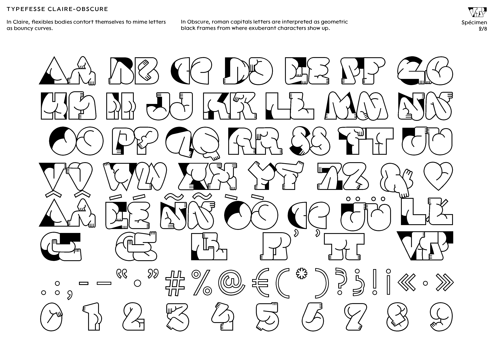
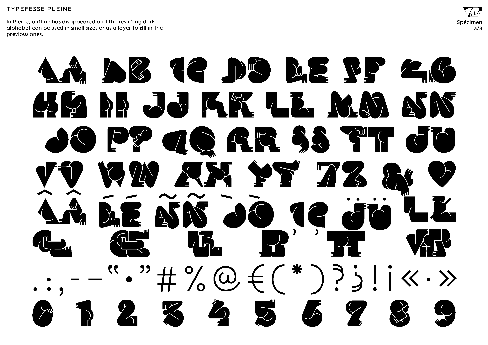
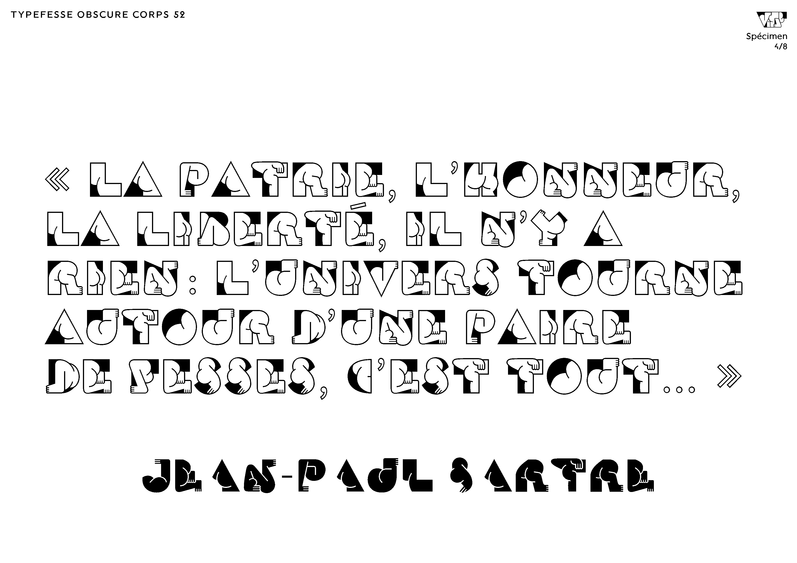
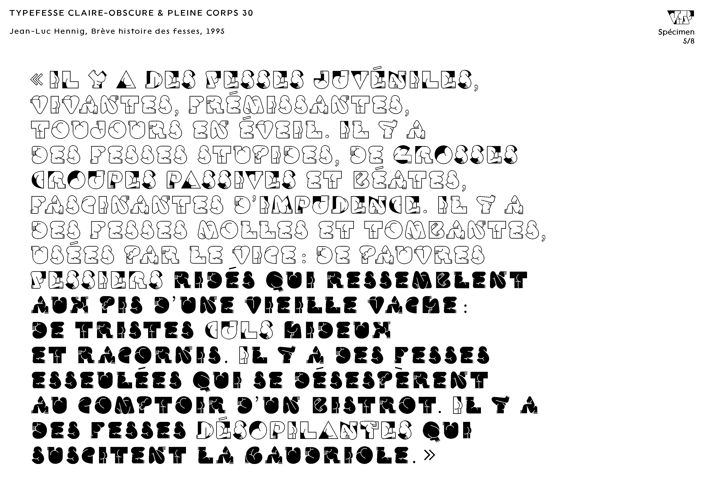
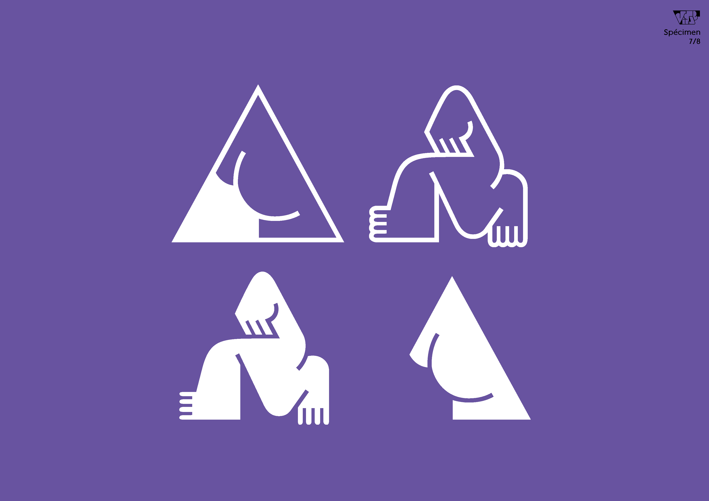

# Typefesse

*Typefesse* is a playful butt-shaped type family designed by [Océane juvin](https://www.behance.net/oceane-jd737) and released by [Velvetyne Type Foundry](http://velvetyne.fr/fonts/typefesse/).

The letters are rendered in such a way that the reading is done through the folds of the body. Its three styles have been named in reference to the moon and its mysteries.
1. In Claire, flexibles bodies contort themselves to mime letters as bouncy curves.
2. In Obscure, roman capitals letters are interpreted as geometric black frames from where exuberant characters show up.
3. In Pleine, outline has disappeared and the resulting dark alphabet can be used in small sizes or as a layer to fill in the previous ones.

They are ordered in 2 font-files: *Typefesse Claire-Obscure* where capitals are Obscure whereas lower cases are Claire and *Typefesse Pleine* where outlines have been removed. These illustrated letters that challenge reading share the display taste from 70's.

Contribute or download it on [Velvetyne Type Foundry](http://velvetyne.fr/fonts/typefesse/).

## Specimen

## License

Typefesse is licensed under the SIL Open Font License, Version 1.1.
This license is copied below, and is also available with a FAQ at
http://scripts.sil.org/OFL

## Repository Layout

This font repository structure is inspired by [Unified Font Repository v0.3](https://github.com/unified-font-repository/Unified-Font-Repository).
